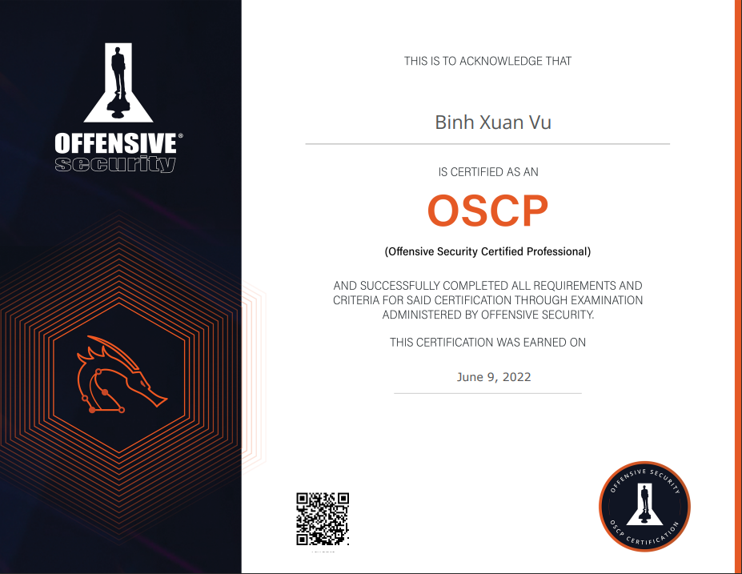

<h1>Lan tỏa tấu hài đi muôn nơi  🙃 🙃</h1>

<!--more-->
Tôi dự định học OSCP từ tháng 8/2021 nhưng vì một số lý do mà đến tháng 3/2022 tôi mới bắt đầu đăng kí học được. Vì không phải mất tiền(làm gì có bữa trưa nào miễn phí, tôi phải anh bạn à liên tục vào mồm đấy 🤪🤪🤪)  nên tôi đã đăng kí PEN-200 course + 90-days lab access. Theo lịch chính thức khóa học sẽ bắt đầu vào 13/3, nhưng sau khi nghe văn khích của 2 đồng đội ( Sợ à 🙂) tôi đã thay đổi lịch học để bắt đầu sớm hơn. Hành trình tấu hài bắt đầu từ đây(Adventure Time)

Khi bắt đầu làm một thứ gì đó, tôi thường sẽ hình dung về những việc mình sẽ làm và đây cũng không phải là ngoại lệ. Tôi đã lên kế hoạch trong đầu mà theo tôi nghĩ nó là tuyệt vời con mịa nó rồi. Sơ qua về kế hoạch cực kì chi tiết:

- Đọc hết sách PWK
- Làm hết Lab được cung cấp
- Làm thêm với HTB và PG
- Viết report exercise để kiếm 10 point

Như một lẽ thường tình, tôi đã hoàn thành được những 1/4 kế hoạch hoàn hảo tôi đã đặt ra là hoàn thành tất cả lab trong bài học còn các việc khác trong tình trạng như sau:

- Đọc sách đến 1/3 thì thấy đều là những kiến thức tôi biết rồi nên tôi quyết định tạm dừng việc đọc sách (tạm dừng vĩnh viễn chứ không phải bỏ nhé 😄)để chuyển sang thực hành.
- Phải thừa nhận việc viết report exercise không hề đơn giản như tôi nghĩ. Khi đã viết được 3 chương đầu và hóng được report sẽ dài khoảng 400 trang, tôi cho nó chim cút luôn.

Trong 3 tháng học đó, công việc hàng ngày của tôi sẽ là dù có bận đến đâu sáng tôi cũng sẽ ngồi làm lab đến lúc ăn. Trong lúc ăn trưa thì tấu hài với 2 thằng cùng cty cũng đang học OSCP, xin được shoutout cho 2 đồng đội. Một trong 2 thằng là kẻ hủy diệt toán học, ông trùm phương pháp tính( kỉ lục 4 lần liên tiếp trượt) , thủ khoa đại học bách khoa với số điểm 29.75 aka datmom.exe ☠️ và cũng là kẻ tạo ra những câu punch line để đời. Kẻ còn lại là một con lợn trong hình hài con người và cũng là ông trùm giấu tin trong ảnh( chịuuu nhé), kẻ bề tôi của Vua nụ cười của cty. Sau khi học xong tôi mới hiểu được slogan của offsec “Try Harder !!” 💯 , cố gắng hơn nữa khi mình nghĩ mình đang cố gắng điều này giúp tôi khá nhiều trong khi làm lab. Mất khoảng 2 tháng để tôi hoàn thành hết tất cả bài lab trong khóa học, mặc dù có thể thi luôn nhưng do chưa biết đề thi format mới thế nào nên tôi quyết định mua thử 1 tháng PG để làm tiếp cũng như tăng độ tự tin khi làm bài. Dự định ban đầu của tôi sẽ là từ PG chọn ngẫu nhiên ra để thành 1 đề thi thử, tuy nhiên sau khi làm 1 số bài có cả brute force mật khẩu( hẳn phải tuyệt vọng lắm thì tôi mới nghĩ đến brute force) và trong đó cũng không hề có các bài về AD nên tôi quyết định không làm thử để tránh ảnh hưởng đến sự tự tin của mình. Cảm thấy việc chờ đợi khá là chán nản thêm việc con lợn trong hình hài con người đã tự hủy trước nên tôi quyết định đăng kí ngày thi sau nó khoảng 1 tuần tức là ngày 9/6.

Quá trình làm bài cũng tấu hài không kém. “Đầu xuôi đuôi lọt” nhưng khởi đầu đã tấu hài rồi. Bắt đầu bằng việc đăng nhập vào hệ thống để thi thì hệ thống lỗi. Sau một hồi gửi mail nhờ hỗ trợ tôi được cộng thêm 30 phút do lỗi hệ thống. Kết nối thành công đến máy thi sau mở đầu không thể cồng kềnh hơn, mở đề và surprise trong đó có 5 máy trong khi đề thi bình thường là 4. Và điều tôi sợ nhất đã xảy ra BOF 🙂 từ lúc học tôi đã không thích BOF không phải vì nó khó hiểu mà nó thật sự quá dập khuôn chỉ làm theo các bước. Sau khoảng 3 tiếng tôi đã hoàn thành AD và 1 máy khác, lúc này tôi đã có 60 point ( thiếu đúng 10 point để đủ điểm đỗ). Trong đầu tôi lúc này nghĩ “Hình như chọn nhầm độ khó rồi, game này hơi dễ !!” 🙃 🙃  (gáy sớm thì làm sao nhỉ 🙂 🙂). Hai bài còn lại đấm liên tục không trượt phát nào vào mồm tôi, BOF tôi xác định bỏ ngay từ đầu nên tôi quyết định tập trung vào bài còn lại. Trong lúc recon, tôi đi làm mấy trò con bò như lên youtube nghe nhạc và suy nghĩ chuẩn bị lúc làm xong sẽ gáy những gì. Hai tiếng tiếp theo không có gì đặc biệt nên tôi xin break để ăn cơm, nghỉ ngơi thư giãn 1 tiếng sau tôi tiếp tục làm lúc đó vào khoảng 8h mà tôi tự tin trong tối sẽ làm xong được. Dễ thế thì tôi đã gáy to rồi câu chuyện luôn có từ “nhưng” đến tận 12h đêm hôm đó vẫn cứ là nohope. Haizz

Hẳn là tuyệt vọng lắm tôi mới quay xe về BOF 🤐🤐. Tiếp tục xin break khoảng 2 tiếng để yêu lại từ đầu BOF. Shoutout cho vị vua kính mến ở trên vì đã khai sáng BOF cho tôi. Sau 2 tiếng break tôi kiểu “Dăm ba BOF 🤣🤣”. Mất thêm khoảng 30 phút để thực sự hoàn thành máy. Đến 3h sáng trong tay tôi đã có 80 point và hoàn toàn có thể dừng nhưng 100 point vẫn được gáy to hơn nên tôi quyết định làm tiếp. Tôi recon lại từ đầu nhưng vẫn không thành công nên sau khoảng hơn 10 tiếng dành cho nó, tôi quyết định xin phép được kết thúc sớm thi. Việc cuối cùng là viết report và đợi mail thôi. Thành quả sau 3 tháng tấu hài.

Title của tôi định gáy là “**OSCP đã khiến tôi thất vọng như nào**”

Bài học rút ra ở đây là gì đừng có gáy sớm( gáy đến chết)  và try harder!