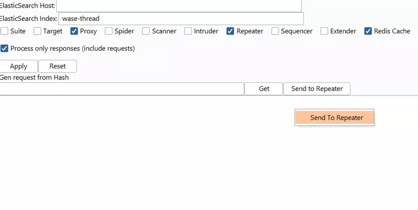

# My Data My Choice - P1. ElasticBurp-NG

<h1>New series from 0 to 1k stars 🤡🤡</h1>

<!--more-->
## **Mở đầu**

Trong một lần tình cờ được ngồi nói chuyện với anh Luật ( Founder của CyberJustu ), mình đã được anh chia sẻ rất nhiều vấn đề hay và bị ấn tượng bởi câu hỏi "*Bọn em làm gì với đống request sau 1 dự án pentest?*". Tại thời điểm đó, mình chỉ quan tâm đến report của dự án như là: Có tìm được lỗi không, mức độ ảnh hưởng ra sao hay cách khai thác có gì mới lạ không ?. Sau khi nghe câu trả lời từ anh mình kiểu.

Đại khái ý tưởng là: **Burp => Request => Log => Big Data => Process => Do something**

Có ý tưởng rồi thì phải làm thôi Gét Go *My Data My Choice*.
### **ELK Stack**

Nghĩ đến việc ghi log thì ELK stack là trùm, nói sơ qua một chút về ELK Stack thì đây là combo thần thánh trong việc logging. ELK Stack bao gồm 3 phần:

- ElasticSearch: Cơ sở dữ liệu để lưu trữ, tìm kiếm và query log.
- Logstash: Tiếp nhận log từ nhiều nguồn, xử lý và ghi dữ liệu log vào ElasitcSearch.
- Kibana: Giao diện quản lý, thống kê log từ ElasticSearch.

Trong trường hợp này, đa số mình sẽ chỉ lấy log từ BurpSuite nên việc sử dụng Logstash là không cần thiết nên mình rút gọn lại chỉ sử dụng ElasticSearch và Kibana.

## [ElasticBurp-NG](https://github.com/n00b-bot/elastic-burp)

### **Logger++ và ElasticBurp**

Từ ý tưởng trên thì mình có 2 hướng tiếp cận:

- Viết 1 proxy rồi cho BurpSuite đi qua, từ đó đẩy lên ElasticSearch: Tuy nhiên, trong quá trình phát triển mình nhận thấy cách tiếp cận này có khá nhiều bất cập nên mình chọn hướng tiếp cận thứ 2.
- Viết BurpSuite Extension cho phép đẩy log lên ElasticSearch: Cách tiếp cận này gần như giải quyết hết các vấn đề mình quan tâm nhưng  tại sao mình không chọn hướng tiếp cận này đầu tiên ?. Đơn giản mình không thích Python còn Java thì mỗi lần chỉnh sửa code lại phải compile ra file jar để sử dụng.

Google Search "How to write Burp Extension with Go" => Rewrite Burp to support Go

🤡🤡🤡🤡🤡🤡🤡🤡

Lượn lờ trên mạng thì thấy có 2 Burp Extension phù hợp: Logger++ và ElasticBurp. Sau khi xem cả 2 extension thì mình thấy:

- Logger++ nhiều chức năng không cần đến, lại viết bằng java nên nếu muốn thêm một số chức năng thì lại phải complie tốn time => Lười => Next

- ElasticBurp ít chức năng nhưng viết bằng Python => dễ dàng customize=> Vì vậy mình sẽ lấy luôn mã nguồn của ElasticBurp được tạo bởi thomaspatzke để cải tiến cũng như phát triển thêm một số tính năng để thực hiện ý tưởng ban đầu.

## **Develop**

Theo như hướng dẫn của ElasticBurp trên github:

1. Cài đặt [ElasticSearch](https://www.digitalocean.com/community/tutorials/how-to-install-and-configure-elasticsearch-on-ubuntu-20-04#step-1-installing-and-configuring-elasticsearch)
2. Cài [ElasticBurp](https://github.com/thomaspatzke/WASE)
3. Cấu hình và chạy

Làm theo hướng dẫn và bùm lỗi liên tục vào mồm. Đã lười thì chớ lại còn phải fix bug nữa. Dưới đây là các lỗi khiến mình nhớ nhất.

### **TypeError: unicode indices must be integers**

Vừa cấu hình và nhấn apply thì đã có cái lỗi đấm vào mồm rồi.

**Nguyên nhân**: Do sử dụng sai phiên bản thư viện elasticsearch và elasticsearch-dsl. ElasticSearch mình đang sử dụng là phiên bản 7.17.5 trong khi phiên bản của 2 thư viện elasticsearch và elasticsearch-dsl được cài theo extension là 6.0.0.

**Cách khắc phục**: Update 2 thư viện lên phiên bản tương thích với ElasticSearch 7.x. Mình đã fix thành công và đẩy được log lên server ElasticSearch nhưng mình lại gặp vấn đề với hiệu năng.

### **Lỗi Performance**

Khi sử dụng extension, mình thấy hiệu năng giảm rõ rệt. Request xử lý rất là chậm khi so sánh với lúc không sử dụng. Điều này thường xuyên xảy ra với các trang web gửi nhiều request như Facebook, bình thường truy cập vào Facebook chỉ mất 1-2 giây là load xong mà khi sử dụng extension mất tới 30 giây mới load xong và nó gây khó chịu y như lúc mạng lag.

**Nguyên nhân** : Do default timeout là 10s nên khi gặp lỗi timeout thì request phải đợi 10s mới được tiếp tục xử lý.

**Cách khắc phục**: Giảm thời gian timeout. Vấn đề trên đã được giải quyết nhưng khi mình kiểm tra thì thấy số lượng request không đẩy lên ElasticSearch khá là nhiều. Sau khi search thì mình thấy có 2 khả năng là nguyên nhân chính:

- Do Server yếu không đáp ứng được.
- Dữ liệu lớn mà thời gian timeout đặt chưa hợp lý.

Mình đã thử sử dụng Logger++ để kiểm tra xem nguyên nhân thực sự thì thấy Logger++ vẫn log được đầy đủ các requests. Tham khảo cách xử lý của Logger++ thì cách giải quyết là lưu dữ liệu và Lại quay về câu chuyện con gà và quả trứng: nếu đặt timeout thấp thì mất dữ liệu còn nếu đặt timeout cao thì request xử lý chậm. Mình đã thử sử dụng Logger++ để kiểm tra xem có gặp lỗi có phải do phía server hay không thì không thấy tình trạng tương tự xảy ra. Sau khi đọc source code , mình biết được cách cách xử lý của Logger++  là có 1 list để lưu các request và đẩy lên server sau 1 khoảng thời gian nhất định.

Đến đây có thể tạm kết luận nguyên nhân là do timeout chưa hợp lý. Lại quay về câu chuyện con gà và quả trứng nếu để timeout thấp thì thường xuyên mất request còn để timeout cao thì thời gian xử lý request lâu gây khó chịu.

Time to đa luồng: Cách xử lý là tạo 1 luồng để thực hiện việc ghi và tăng timeout lên => Cả 2 vấn đề đều đã được giải quyết.Tuy nhiên tình trạng mất request do timeout vẫn xảy ra nhưng không đáng kể.

### **Redis cache**

Đây là 1 chức năng mình thêm vào để giảm thiểu các request trùng lặp cũng như cải thiện performance.

**Nguyên nhân:**: Trước khi thêm 1 chức năng mới mình thường kiểm tra code trên Python trước, code đã chạy như mình mong đợi nhưng lúc chạy với Burp lại thông báo lỗi liên quan đến socket. Mất khoảng 1 ngày mình mới tìm thấy nguyên nhân của vấn đề là do cách xử lý lỗi với socket của Jython trên Windows khác thông thường. Chi tiết về lỗi có thể đọc ở [đây](https://github.com/n00b-bot/elastic-burp/issues/1)

**Cách khắc phục**: Cách khắc phục đã được mình nói ở phần issues nên ở đây mình không nói lại nữa.

Trong thời gian phát triển mình gặp khá nhiều lỗi ối dồi ôi mà không đề cập ở đây.

## **Feature**

Extension có 2 tính năng chính là:

- Tập trung log của các thành viên trong team khi pentest:
- Cho phép chia sẻ request

Thử tưởng tượng trong trường hợp bạn gặp 1 request khả nghi dính XSS nhưng chưa tìm được cách bypass và muốn chia sẻ request đấy cho người khác thì đơn giản chỉ cần đưa mã hash của request đấy thay vì phải copy toàn bộ request.

Nếu có bất kỳ lỗi nào trong quá trình sử dụng hay có ý tưởng gì các bạn có thể phản hồi để mình có thể hoàn thiện ElasticBurp-NG

## **Install**

Start here 👇️👇️👇️ [https://github.com/n00b-bot/elastic-burp](https://github.com/n00b-bot/elastic-burp)

## **Thanks**

- ML from CyberJustu vì chia sẻ ý tưởng.
- thomaspatzke vì tạo ra ElasticBurp.
- DamionNg, quaccws, datmom.txt, ewind vì những đóng góp tấu hài.
