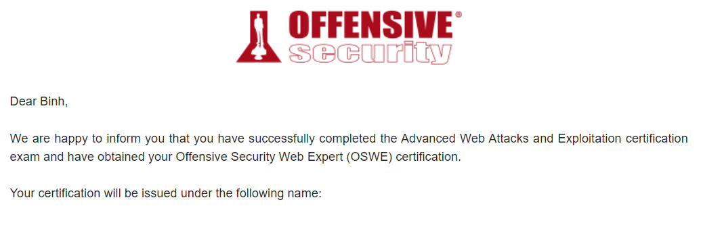
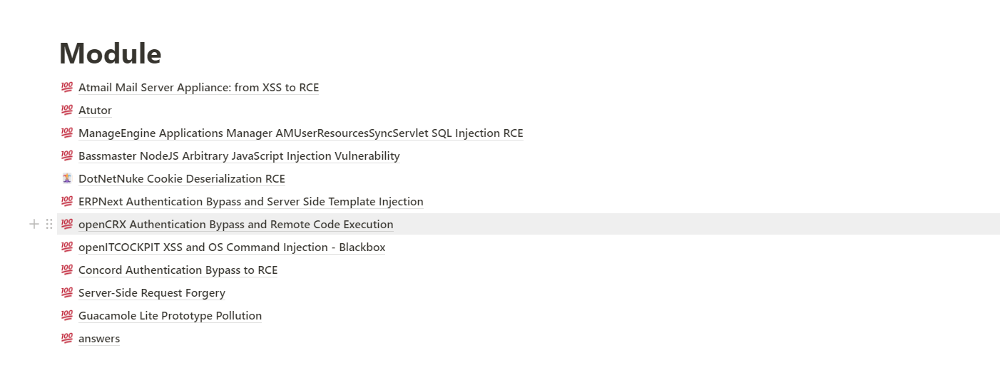

# Đôi lời về OSWE

<h1>Finish my year</h1>

<!--more-->
Ban đầu mình không định đăng kí học OSWE vì vừa lấy OSCP xong cộng thêm việc cũng nhiều nữa. Tuy nhiên, lại xảy ra sự việc ngoài ý muốn nên vào buổi tối đó chả hiểu nghĩ thế nào 12h đêm dậy đăng kí OSWE và thế là bay luôn 1649$ vì một phút bốc đồng. Sáng hôm sau, thấy bản thân tự hủy rồi nhưng lỡ rồi thì lại phải học => hành trình 2 tháng try hard bắt đầu.

## **OSWE là gì**
### Course
Advanced Web Attacks and Exploitation (WEB-300) là khóa học bảo mật ứng dụng web theo hướng whitebox và cũng là ước ao của mình tại thời điểm đăng kí. Đây là khóa học nâng cao vì nó yêu cầu một số kiến thức trước khi học như là 
* Có khả năng viết và đọc code.
* Hiểu rõ về các loại tấn công web.
* Sử dụng thành thạo web proxy như là Burp.
* ...

Sau khi học mình thấy một số ưu và nhược điểm của khóa học
* Ưu điểm: 
  * Cung cấp cho người học một các nhìn toàn diện cũng như hiễu rõ về từng loại lỗ hổng được đề cập.
  * Các bài tập Extra Miles giúp kiểm tra kiến thức được truyền tải trong từng module.
  * Video hướng dẫn khá là chi tiết và dễ hiểu.
* Nhược điểm:
  * Các máy lab còn khá ít không như OSCP làm ngập mồm 
  * Chưa đề cập các lỗi mới xuất hiện như Broken Auth, OAuth 2.0, ...

### Exam
Để có được chứng chỉ bạn sẽ phải vượt qua 1 bài thi bao gồm source code của 2 web app và có 48h tuyệt vọng để đạt ít nhất 85/100 and ...

## Hành trình để lấy chứng chỉ
### Learn
Trong quá trình học mặc dù được hướng dẫn theo cách tiếp cận whitebox nhưng mình luôn bắt đầu thử với blackbox vì đa số công việc hàng ngày mình sẽ phải tiếp cận theo hướng này. Mục tiêu của mình là sẽ cố gắng tìm ra lỗi bằng blackbox với tất cả module được học, mặc dù không đạt được mục tiêu đề ra nhưng mình cũng khá hài lòng với những bài mình đã làm được bằng blackbox.

Mình sử dụng Notion để ghi lại các điểm chú ý của module đấy như: flow code dẫn đến lỗ hổng, tại sao lỗ hổng lại xảy ra, suy nghĩ của bản thân về các vector, payload được sử dụng, ...

Mình mất khoảng 2 tháng (đa số thời gian mình sử dụng là cho việc blackbox) để hoàn thành tất cả các module được hướng dẫn và extra miles, tiếp đến là làm 3 bài cuối cùng không có hướng dẫn để kiểm tra kiến thức đã được học cũng như là tăng độ tự tin cho bản thân. Sau 2 ngày, mình hoàn thành cả 3 bài và lúc đó cảm thấy "feel a godlike" liền đi đăng kí ngày thi luôn. Ban đầu, mình chọn thi ngày 5/12 nhưng sau 1 hôm mình lại cảm thấy ghét cái cảm giác chờ đợi này nên đã chuyển thành ngày 18/11.

### Exam
Bằng 1 cách thần kì nào đó cả 2 lần mình thi OSCP và OSWE đều vào các dạng mình cực gì ghét là BOF và Client-side Attack không phải vì nó khó mà nó tốn nhiều thời gian để khai thác. Bài đầu tiên mình mất khoảng 2h để tìm vector bypass auth, có khá là nhiều rabbit hole nếu bạn không nhận ra sớm sẽ rất tốn thời gian. Một khi bạn bypass được auth thì RCE nó chỉ là vấn đề thời gian và cái giá mình phải trả ở đây chỉ là 2h. Vậy là sau 4h mình đã có được 50 points và chỉ cần tìm được vector bypass auth ở bài 2 là đủ điểm. Sau khi đọc mô tả của bài mình nghĩ thôi lại gặp Client-side Attack, do biết được vector bypass auth nên mình tìm được vector ngay sau đó khoảng 1h. Vector RCE bài 2 mình tìm được cũng không lâu sau đó nhưng nó khá là tốn time để khai thác nên mình đã cố chấp không theo hướng đấy mà tìm một hướng khác ít tốn thời gian hơn và kết quả và mình tốn thời gian x2 cho việc RCE. Vậy là sau khoảng 15h try hard thì mình đã đạt được 100 points, đến lúc này mình khá là vui nên xin break tí để đi gáy và chuẩn bị cho phần khó nhất là viết POC và report. Viết report tiêu tốn của mình đâu đó khoảng 10h chỉ ngồi viết xong lại xóa, mình cảm thấy việc viết report nó còn khó hơn cả lúc làm bài thi vì nó đem lại cảm giác nhàm chán kinh khủng !

## Suy nghĩ
Sau khi pass OSWE mình cảm thấy khá là vui vì trong quá trình học mình tiếp thu thêm được rất nhiều kiến thức mới, cách tiếp cận vấn đề và mindset *try harder*. Tuy nhiên, mình vẫn cảm thấy hơi hụt hẫng vì mình mong đợi exam sẽ đem lại nhiều thử thách hơn cho mình để rồi vui sướng khi vượt quá các thử thách khó khăn.
